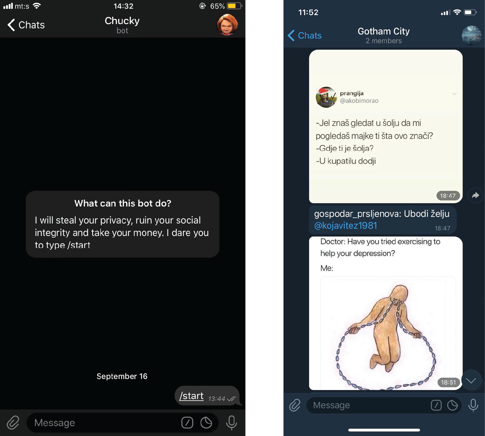

# Automated Instagram Media Collector   

 Python bot for collecting media from Instagram users and distribute it through Telegram into groups.
 
 Bot is used for automatically collecting media from selected Instagram accounts, sending server calls every 60 seconds and checking for updates. Once some of the profiles have a new Instagram post, Bot will detect change, download media send it to you on Telegram with all info about media, caption and account that posted.
 
 ##  Telegram Bot     
 
 
 
 
 ##  Installation
 
Creating a Bot on Telegram:
- Visit BotFather channel on Telegram
- Send command /newbot
- Give the Telegram bot a friendly name
- Give the Telegram bot a unique username
- Save the access token

Install Python:
- Install python 3.6+
- Add it to PATH if not automatically

Requirements:
- Run CMD as administrator
```elm
pip install instaloader
pip install telegram-send
```
Connecting Telegram bot:
- Run CMD as administrator
```elm
telegram-send --configure-group
```
- Paste the bot API you've got from BotFather

- Edit telegram_bot.py for accounts you'd like to follow, and run it.


## Requirements
- instaloader
- telegram-send

### An example of my bot and Telegram group with feed:
<p align="center">
  
</p>

## What's included

Within the download you'll find common assets providing both compiled and minified variations. You should see something like this:

```text
Automated-Media-Collector/
└── telegram_bot.py
├── chucky_bot.jpg
└── chucky_interaction
```
